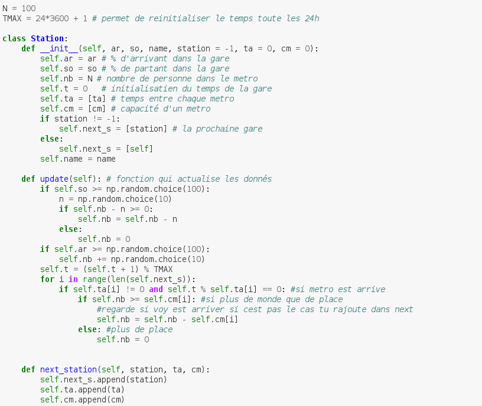
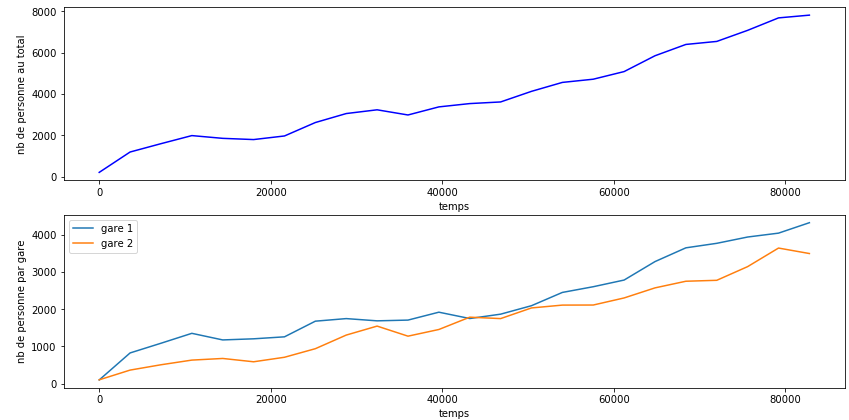
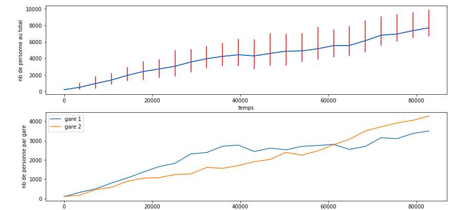

# RATP_Project

  

FOLTYN Axel  
ROBIN Barthelemy  
CHARTIER Romain  
QUILLIOU Edouard  

[reference_code](https://are00dynamic-2018.github.io/RATP_Project/sous_partie/référence_code)

Nous allons travailler sur la modélisation d'un réseau de transport (métro).  
Pour faire notre premiere simulation nous avons reflechi aux parametres que nous devions utilisé
Nous avons commencé par faire une simulation d'une ligne métro à 2 gares avec pour parametres :  
 - le pourcentage d'arrivant dans une gare (ar)
 - le pourcentage de personnes sortant de la gare apres avoir trop attendu (so)
 - Le nombre total de personne presente dans la gare au depart (N) 
 - La capacité d'un train (cm)
 - initialisatien du temps de la gare (t)
 - Le nombre de personne dans la gare a l'instant t (nb)
 - le temps d'attente entre chaque metro (ta)
 
 Nous créer les gares avec une classe :  

Nous avons créer une fonction simulation qui renvoie le nombre de personne presente dans les gares en fonction du temps.  
Nous avons ensuite créer un fonction dessin afin de mettre en forme ses resultats :  

  
Pour mieux nous repartir les taches nous avons decidé de créer un TODO qui liste les différents travaux à faire.  

Pour verifier l'exactitude de notre simullation nous avons decider d'afficher la moyenne de 100 simulations ainsi que des barres d'erreurs dans un intervalle de confiance de 95%.  
  
  

Nous avons ensuite fait une simulation avec trois gare mais nous avons decider d'arreter cette simulation car peu pertinente.
Nous avons remanié notre classe Station afin de pouvoir initialiser les gares avec leur nom et leurs gares voisines.

